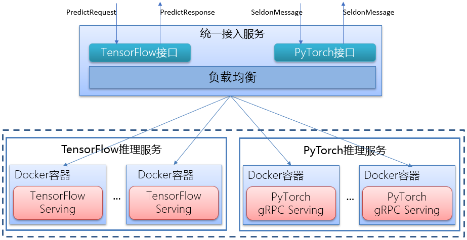
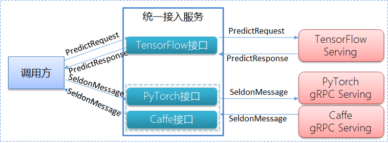
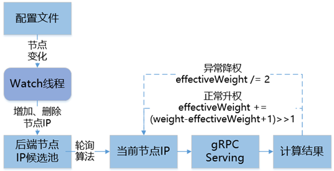
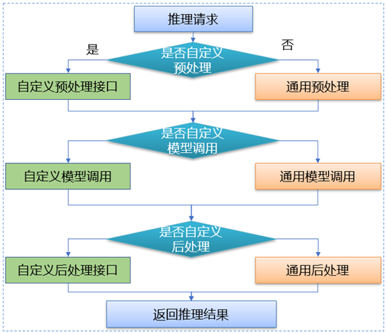

# 通用深度学习推理服务
可在生产环境中快速上线由TensorFlow、PyTorch框架训练出的深度学习模型。
  
dl_inference是58同城推出的通用深度学习推理服务，使用dl_inference只需要将模型文件放在指定目录然后启动服务就可以进行推理请求调用。dl_inference当前支持TensorFlow和PyTorch模型，提供GPU和CPU两种部署方式，并且实现了模型多节点部署时的负载均衡策略，支持线上海量推理请求，该服务支撑了58同城各AI场景下日均超过10亿次的线上推理请求。  

dl_inference具备的Features如下：
* 简化深度学习模型在生产环境上的推理服务部署，只需要将模型文件放入指定目录。
* 支持模型多节点部署并实现负载均衡。
* 提供统一的RPC服务调用接口。
* 提供GPU和CPU两种部署方式。
* PyTorch模型支持推理前后数据处理，开放模型调用。

## 为什么需要dl_inference  
将深度学习模型进行部署实现推理服务是算法应用到生产环境的最后一环。当前主流的深度学习框架TensorFlow和PyTorch推理服务实现介绍如下：
1. TensorFlow推理
最常见的是采用TensorFlow Serving这一组件进行部署，在生产环境中推荐使用Docker部署TensorFlow Serving。TensorFlow Serving可以直接读取SavedModel格式模型文件进行部署，支持热更新模型，支持以gRPC和RESTful API进行调用。  
当一个模型需要部署多个节点时，采用TensorFlow Serving组件部署时需要解决请求负载均衡问题，dl_inference基于动态加权轮询算法实现多个推理节点的负载均衡，很好的解决了这一问题。  
2. PyTorch推理
PyTorch框架不提供服务化部署组件，需要用户自己开发实现，大致有两种解决方案。第一种是利用服务化框架进行封装，比如使用Flask框架部署一个http服务，编写API来进行请求处理， API里调用PyTorch推理函数；第二种是将PyTorch模型利用ONNX转换为onnx格式，然后再转换为TensorFlow或Caffe的模型，再通过TensorFlow Serving 或Caffe来进行推理部署。  
第一种方式需要用户自行进行服务化封装，开发工作量大；第二种方式也存在诸多缺陷，如PyTorch模型转onnx格式存在失败情况且转成onnx格式后推理性能会有损耗。dl_inference基于Seldon对PyTorch进行封装提供RPC服务调用，用户只需要将PyTorch模型放在指定目录启动dl_inference即可进行线上推理调用。  

## dl_inference架构  
dl_inference主要包括统一接入服务、TensorFlow推理服务、PyTorch推理服务三个模块，如下图所示。  
  

## 统一接入服务
[统一接入服务](./DLPredictOnline)基于gRPC实现，作为深度学习模型在线推理请求入口，提供TensorFlow、PyTorch两种模型通用调用接口，接收调用方在线推理请求，与后端部署的TensorFlow或PyTorch模型实例进行交互，实现负载均衡策略。统一接入服务主要实现了接口统一和负载均衡两项功能，下面分别进行介绍。  

深度学习模型类型多样，不同模型在线推理请求对应的输入输出数据格式不同，不仅是输入输出的key数量不同，而且数据类型也不一致。针对这一问题，统一接入服务定义TensorFlow和PyTorch两个通用接口来兼容这两大主流深度学习框架所训练模型的推理请求。  
接口定义如下：
```$xslt
service WpaiDLPredictOnlineService {
    rpc Predict(PredictRequest) returns (PredictResponse);
    rpc PytorchPredict(PytorchPredictRequest) returns (PytorchPredictResponse);
}
```  

  

1. TensorFlow接口：与TensorFlow-Serving推理引擎保持一致，请求协议PredictRequest对象，返回协议PredictResponse对象，统一接入服务将用户构建的PredictRequest对象请求直接透传给后端TensorFlow-Serving实例。  
2. PyTorch接口：PyTorch框架没有提供对应的推理引擎，我们基于Seldon将PyTorch推理函数封装为gRPC服务，统一接入服务的PyTorch接口采用封装的PyTorch gRPC服务协议SeldonMessage作为输入和输出。SeldonMessage支持各种格式数据的传递，如String类型数据、Tensor类型数据、Bytes类型数据等。  

深度学习模型进行推理部署时根据线上流量大小会部署多个实例，统一接入服务需要将接收到的推理请求均匀的转发到后端实例，剔除不可用实例。统一接入服务基于动态加权轮询算法实现模型实例的请求负载均衡，根据每次请求结果来判断对应节点是否正常，来动态调整节点有效权重，若节点异常响应，如宕机、网络异常等情况，能快速降低节点有效权重，保证节点被选中的概率减少，以此来降低发送到节点上的流量比；反之节点正常响应，能快速提升节点有效权重，保证节点被选中概率增加，以此来提升发送到节点上的流量比。
    

## TensorFlow推理服务  
TensorFlow模型推理采用TensorFlow-Serving开源推理引擎部署，部署方式支持物理机、Docker容器。部署模型首先需要准备模型数据，支持SavedModel模型文件格式。物理机部署需要安装Tensorflow-Serving环境，步骤较为复杂，相对物理机部署方式容器化部署更简单，无需安装环境，即开即用，操作方便，从Docker hub上下载对应版本的Tensorflow-Serving镜像，使用docker run命令运行镜像，挂载模型文件到容器内部，指定服务监听端口并绑定到宿主机上即部署完成。采用TensorFlow-Serving引擎部署有诸多优点，如支持分布式TensorFlow模型、GPU推理加速、多种编程语言客户端、多个模型同时提供服务、模型动态加载及卸载等。   

TensorFlow模型推理支持自定义operate，用户在训练TensorFlow模型时会添加自己定义的算法实现，添加Tensorflow中不存在的operate或针对现有场景下算法的个性化优化，用于提升训练效率。在TensorFlow-Serving官方提供的镜像并不支持自定义operate，因此需通过修改TensorFlow-Serving源码重新编译来实现。  

## PyTorch推理服务

PyTorch框架没有提供对应的模型服务化组件，dl_inference基于Seldon封装了PyTorch模型推理RPC服务，统一接口协议，适用任何类型的PyTorch模型，极大减少PyTorch模型部署工作量。同时在PyTorch模型RPC服务封装时我们进行了创新，首先，引入前后预处理程序， 支持用户在执行Pytorch模型推理前后进行相关数据的处理；其次 ，开放模型调用，用户可以根据业务及模型的特点进行模型调用独立定制。PyTorch模型部署步骤如下：  
1. 安装Docker环境，使用本项目提供的镜像启动容器。
2. 准备好PyTorch模型、前后处理Python程序放入指定目录。
3. 执行startPredict.sh脚本启动模型推理RPC服务。

PyTorch模型实例部署后，实例中请求调用流程如下：  


用户可以重新定义自定义接口文件中preprocess（模型执行前数据预处理）、postprocess（模型执行后数据后处理）接口函数，在preprocess中，可以对传入的推理数据还有参数进行预处理操作，比如对图片的字节流数据进行处理，返回模型推理需要的Tensor类型数据；在postprocess中，可以对模型返回的推理结果进行处理，比如对结果进行筛选并剔除多余结果数据，或者将结果数据进行压缩、数学变换等操作。支持推理前后的数据处理，使得线上线下可以使用同一套数据处理，极大的简化了算法开发人员部署模型的工作量，同时还可以在远程部署时，减小网络传递的数据包大小，提高整体推理性能。
  
不同的业务场景模型实现不尽相同，为了支持在不同场景下的模型调用需求，用户可以在自定义接口文件中，重新定义模型的执行过程。默认的模型执行是单次执行，自定义接口函数中，可以多次执行同一个模型，或通过推理数据的参数修改模型内部权重，然后再进行模型调用，实现同一模型适应不通场景下的推理。开放模型调用，提高了模型实现的灵活性，从而满足不同业务方的定制化需求。

项目具体实现参考[PyTorchPredictOnline](./PyTorchPredictOnline)

## 贡献指引
本次开源只是dl_inference贡献社区的一小步，我们真挚地希望开发者向我们提出宝贵的意见和建议。
您可以挑选以下方式向我提交反馈建议和问题：  

1. 在https://github.com/wuba/dl_inference 提交PR或者lssue。
2. 邮件发送至 ailab-opensource@58.com